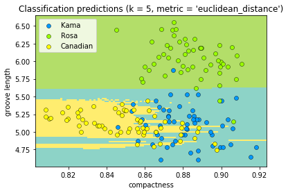
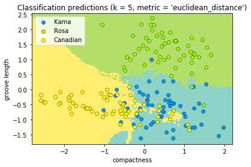
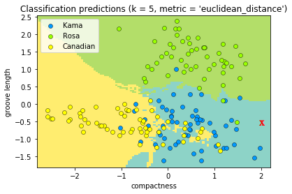

# KNN Assignment

We are finally ready to make our first machine learning model.  In this assignment, you are going to code up the KNN model and then use your knn model to make predictions on real world data.

## Part 1 - EDA

#### 1. Get the data.

Read the `seed_dataset.csv` file into a dataframe.  

Inspect the dataset.  This real dataset represents the results of x-rays into three different types of wheat kernels.  The first 7 columns are the measurements taken from the x-rays.  The `wheat_type` column represents the type of wheat kernel:

1. Kama
2. Rosa
3. Canadian

This is your target.  If you can successfully build a machine learning model that can classify these three types of wheat from the 7 attributes, you could make _billions_.  So let's get to it.


#### 2. Create numpy arrays.

Make a data frame called X that has only the `compactness` and `groove_length` columns.  These are the features you'll use to try to make a prediction.  We're going to start with just these two features, then we'll add more.

Make a dataframe called y that has only the column 'wheat_type'.  This is our target.

From these 2 DataFrames, create 4 __numpy arrays__:

1. X_train:  The first 170 rows of X
2. y_train: The first 170 rows of y
3. X_test: The remaining 40 rows of X
4. y_test: The remaining 40 rows of y

We're going to use X_train and y_train to build the model.  And we'll use X_test and y_test to evaluate our model.
We'll get way more into why we are doing this is future lectures.

(Note: the fact that X is capitalized and y is not is not a mistake. The convention is that because X is a matrix and y is a vector.)


#### 3. Visualize the data.

On this lecture we're not going to have you spend too much time wrestling with matplotlib. In the knn_visualization.py file, you'll find a function to plot the data called plot_predictions.  Import this function and pass in a pyplot axis, X_train and y_train.  For now, leave out classifier, X_test and y_test.  

```
from knn_visualization import plot_predictions
fig, ax = plt.subplots()
plot_predictions(ax, X_train, y_train)
```

#### 4. Have a look at what you've just plotted.  

If you were asked for a quick "rule of thumb" for classifying wheat type based only on compactness and kernel length, what would you say?

## Part 2 - Build the model

#### 5. Let's get some machine learning going.  

We've given you a stub for the KNNClassifier class in the knn.py which you'll need to edit and then import into your notebook.  You'll need to fill in a few of the functions before we can apply it to our data set.   Note that the default k value is 5.

First, implement the `euclidean distance` function in the knn.py file which returns the euclidean distance between two vectors.  

Once you write it, you can use this code to test if you got it right:

```
distance = euclidean_distance (np.array([2, 1, 7]), np.array([2, 4, 11]))
if (distance == 5.0):
    print("You got it.")
else:
    print ("Not quite.")
```

#### 6. Now implement the `fit` function of the KNNClassifier class. 

Remember, in KNN, fit just stores the data.  This will probably be the easiest function you will write in this entire course.

#### 7. Next, implement the `predict` function.

This function will implement this pseudocode:

```
    for every point in the dataset:
        calculate the distance between the point and x
        take the k points with the smallest distances to x 
        find the most common value of y amongst the those k points
        if more there is more than one most common value for y, randomly select one of them
        return this value as our prediction
```

You may find the argsort() function useful here.  You can use it to sort one list in the order of another list:
```
a = np.array([40, 50, 20, 10, 70, 60, 30])  
print("If a were to be sorted, it would use the following *indices* in order:",  x.argsort())
b = np.array(['a', 'b', 'c', 'd', 'e', 'f','g'])
print("Here's b sorted in order of a:", y[x.argsort()])
```
Give this a run and make sure you understand what's going on with it, then implement the ```predict``` function.

#### 8. Now,  test your classifier.  

Create a new KNNClassifer class with k=5 and then call `fit` passing in X_train and y_train.  Now call the plot_predictions function again but this time pass your classifer object into the function as the classifier parameter.  The background colors represent the prediction areas for your model.  It should look like the image below.  Do these predictions look kinda weird?  What do you think the problem is?



#### 9. Hmm, looks kinda weird.  What's going on here?   

The answer lies in the fact that the scale of the y-axis is on different magnitude than the scale of the x-axis.  Since KNN depends on distance, this skews the results.  The compactness is "bullying" the groove_length and that's what's giving those weird horizontal lines in your prediction regions. 

Use the StandardScaler class from sklearn and call `fit_transform` on your X_train.  While you're at it, call `transform` on X_test.

``` 
scaler = StandardScaler()
X_train = scaler.fit_transform(X_train)
X_test = scaler.transform(X_test)
```

Then try calling plot_predictions again.



#### 10. OK, that looks better.   Check how many are incorrect.

Visually, get a rough count of how many classifications are different than their prediction regions.  

#### 11.  Try a small k.

In a new cell, try setting k=1 in your KNNClassifier class and calling plot_predictions again.  How many incorrect predictions now?  Is k=1 better than k=5?

#### 12. Try a very large k
Plot the graph with k = 170 (the size of the dataset.)  How many incorrect values now? 

#### 13.  Look at how the different models predict classifications.

Imagine you had a new kernel that you did not know the classification of and it had a _scaled_ compactness of 2 and a _scaled_ groove_length of -.5.
Take a look at your three graphs.  What would the three different models predict for this data point?  Going by your rule of thumb, which do you think makes the most sense?



#### 14. Now lets look at some unseen data. 

Call plot_predictions again, but this time pass in X_test and y_test instead of None.  Pass in a classifier with k=5 fit to X_train and y_train.  How well do you think your model did?

```plot_predictions(ax, X_train, y_train, classifier, X_test, y_test)```

#### 15.  Try again with k=1.  

When we were training the model we got all of our points correct.  Why is this no longer the case with unseen data? 


#### 16. Quantify the accuracy of your model.

Write a function to compare the accuracy of a predicted set of y values to the actual set of y values.

```
    def get_accuracy(pred_y, actual_y):
        # set y_correct = #times pred_y and actual_y match up
        # set n = length of actual_y
        # return y_correct/n
        pass
```

Then call call this function on your classifier to see what percentage of classifications your model is getting right.

```
    y_pred = classifier.predict(X_test)
    accuracy = get_accuracy(y_pred, y_test)
```

#### 17. Try different values of k.

Loop over all possible values of k from 1 to 170 and instantiate a classifier with each value of k, fit the model to X_train and y_train and get the accuracy of the model predicting on X_test.  Don't use plot_predictions here; it will likely be too slow.

Pick a k where the accuracy is the highest.   There'll be several answers.  Pick the one with the lowest k and report your results.


"I chose a KNN model with k = ____________ and my accuracy on unseen data was __________ "


## Part 4 - Scale up

####  18.  Get the data set with all columns.

Import the dataset again, but this time don't drop any columns.  We now have 7 features instead of 2. 

Split the data set into X_train, y_train, X_test, y_test again.  Don't forgot to use Standard Scaler to scale just like you did above!


#### 19.  Do some EDA on all 7 features.

In part 1, we made a nice clear 2-d plot of compactness vs. groove_length and you were probably able to come up with a quick rule of thumb.  We're in 7 dimensions now so you won't be able to graph things or come up with any easy rule of thumbs. 

Use seaborn's pair plot to get look at how all fields interact with eachother to get some insight.

```
import seaborn as sns
sns.pairplot(df, hue="wheat_type")
```

#### 20. Pick the best k.

Run your accuracy loop from question 17 on the fully scaled data and pick a k that gives you  the best possible accuracy.

Do more features improve your results?

Report your results:

"I chose a KNN model with a k of __________ and my accuracy is ___________"
